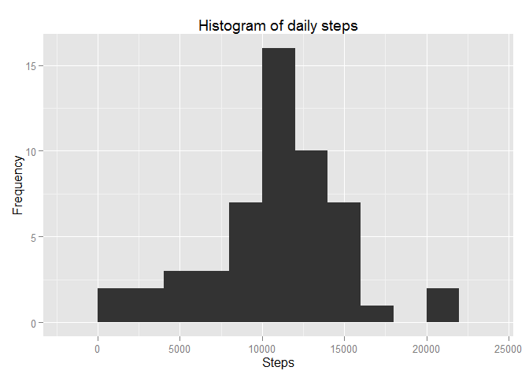
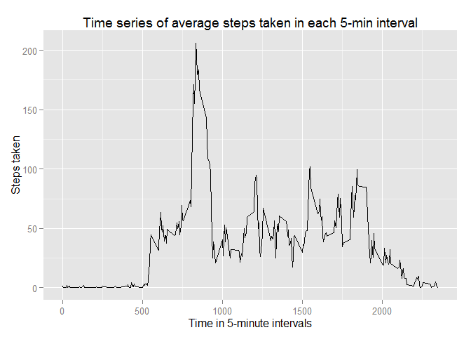
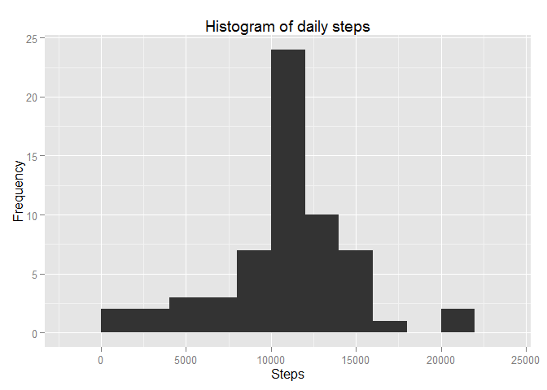
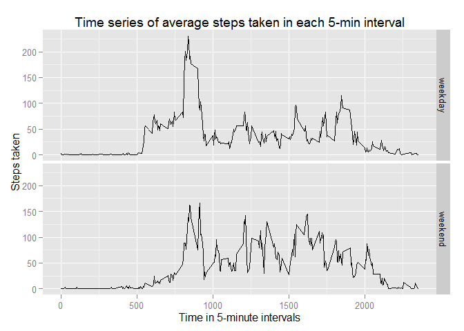

# Reproducible Research: Peer Assessment 1

## Loading and preprocessing the data

#### 1. Load the libraries


```r
library(dplyr)
```

```
## 
## Attaching package: 'dplyr'
## 
## The following object is masked from 'package:stats':
## 
##     filter
## 
## The following objects are masked from 'package:base':
## 
##     intersect, setdiff, setequal, union
```

```r
library(ggplot2)
library(lubridate)
```

```
## Warning: package 'lubridate' was built under R version 3.2.2
```

#### 2. Check if the data file exists and if not download it


```r
activity_file<-'activity.zip'
activity_url<-'https://d396qusza40orc.cloudfront.net/repdata/data/activity.zip'
if(!file.exists(activity_file)){
      download.file(activity_url,activity_file)      
}
```

#### 3. Preprocess the data


```r
act_data<-read.csv2(unz(activity_file,'activity.csv'),sep=',')
act_data$date<-as.Date(act_data$date)

by_day<-group_by(act_data,date)
by_day_nona<-na.omit(by_day)

summary_byday<-summarise(by_day_nona,steps=sum(steps))
```

-----

## What is mean total number of steps taken per day?

#### 1. Generate the histogram


```r
ggplot(summary_byday,aes(x=steps))+geom_histogram(binwidth=2000)+
      xlab('Steps')+ylab('Frequency')+
      ggtitle('Histogram of daily steps')
```

 

#### 2. Calculate the mean and the median


```r
steps_mean<-mean(summary_byday$steps)
steps_median<-median(summary_byday$steps)
```

* Mean is equal to 

```
## [1] 10766.19
```
* Median is equal to

```
## [1] 10765
```
----

## What is the average daily activity pattern?

#### 1. Make a time series plot


```r
average_step_by_interval<-by_day_nona %>%
      group_by(interval) %>% summarise(steps=mean(steps))

ggplot(average_step_by_interval,aes(x=interval,y=steps))+geom_line()+
      xlab('Time in 5-minute intervals')+ylab('Steps taken')+
      ggtitle('Time series of average steps taken in each 5-min interval')
```

 

#### 2. Which 5-minute interval, on average across all the days in the dataset, contains the maximum number of steps?

##### The most steps on average are done at following interval:

```r
average_step_by_interval[which.max(average_step_by_interval$steps),]
```

```
## Source: local data frame [1 x 2]
## 
##   interval    steps
## 1      835 206.1698
```
----

## Imputing missing values

#### 1. Calculate and report the total number of missing values in the dataset

##### The total number of missing values is:

```r
sum(is.na(by_day))
```

```
## [1] 2304
```
#### 2. Devise a strategy for filling in all of the missing values in the dataset.

##### To fill NAs the already calculated mean steps per interval will be used


```r
colnames(average_step_by_interval)[2]<-'avgsteps'
tempdf<-merge(by_day,average_step_by_interval)
```

#### 3. Create a new dataset that is equal to the original dataset but with the missing data filled in.


```r
by_day_fillna<-tempdf %>% group_by(interval) %>%
      mutate(steps=ifelse(is.na(steps),avgsteps,steps)) %>%
      select(-avgsteps) %>% group_by(date)
```

#### 4. Make a histogram of the total number of steps taken each day 


```r
summary_byday_f<-summarise(by_day_fillna,steps=sum(steps))
ggplot(summary_byday_f,aes(x=steps))+geom_histogram(binwidth=2000)+
      xlab('Steps')+ylab('Frequency')+
      ggtitle('Histogram of daily steps')
```

 

#### 5. Calculate and report the mean and median total number of steps taken per day. 


```r
steps_mean_fbyday<-mean(summary_byday_f$steps)
steps_median_fbyday<-median(summary_byday_f$steps)
```

* Mean is 

```
## [1] 10766.19
```

* Median is

```
## [1] 10766.19
```

----

## Are there differences in activity patterns between weekdays and weekends?

#### 1. Create new data frame with additional column encoding if given day is weekday or weekend


```r
by_day_fillna<-by_day_fillna %>%
      mutate(weekday=ifelse((wday(date)>=2 & wday(date)<=6),'weekday','weekend'))
```

#### 2. Make a panel plot containing a time series plot


```r
average_step_by_interval_w<-by_day_fillna %>%
      group_by(interval,weekday) %>% summarise(steps=mean(steps))

ggplot(average_step_by_interval_w,aes(x=interval,y=steps))+geom_line()+
      facet_grid(weekday ~ .)+xlab('Time in 5-minute intervals')+
      ylab('Steps taken')+ggtitle('Time series of average steps taken in each 5-min interval')
```

 


